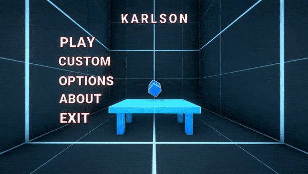

# Karlson Level Importer

> _A mod for [KARLSON](https://danidev.itch.io/karlson) to import custom levels_

## Installation
- [Get latest release here](https://github.com/devilExE3/KarlsonLevelImporter/releases)
- [Get MelonLoader here here](https://cdn.discordapp.com/attachments/837364698949091328/837370417487413338/0.3.1.zip)

1. Copy the contents of MelonLoader archive into the directory that contains Karlson.exe (`.../Karlson/`)
2. Copy the contents of CustomLeverImporterMod.zip into the `.../Karlson/Mods/` directory

## Creating your own level
- **[Get started here](https://github.com/Jor02/KarlsonLevelImporter/wiki)**

## Third party licenses
> Please check [Third party licenses](./THIRDPARTY.md)
